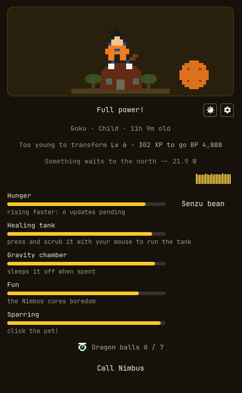
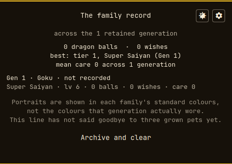
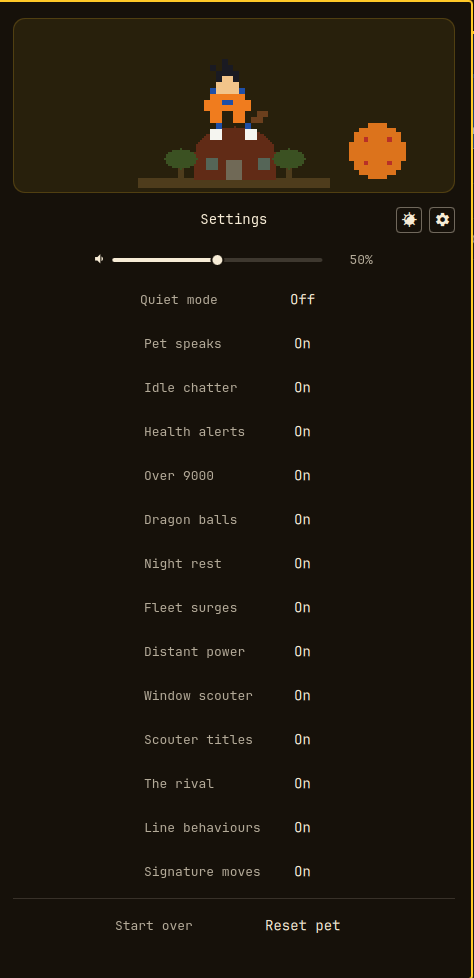

# Omagoku

A Dragon Ball desktop pet for [Omarchy](https://omarchy.org).

It starts as an attack pod sitting in your bar. Something is inside it. You pick which
family it belongs to, it hatches, and from then on it is your problem: it gets hungry, it
gets filthy, it gets bored, and if you ignore it for long enough it will let you know. Give
it a few days of decent treatment and it grows up. Give it a few weeks and it earns things.

It is not a screensaver. It reacts to the machine it lives on. When your CPU is working
hard the pet feels it, and if it is strong enough and in good enough shape, it transforms.
Pending updates make it hungry faster. Orphaned packages make it grubby. None of that
depends on how fast your hardware is, only on what it is doing.



The family record keeps every pet that has ended, and the settings pane is where you turn
things off:

<p>
  
  
</p>

## Whose pod is it

Click the pod in your bar and the card asks one question: whose is it. Five families
answer, each with the name its first generation would carry and a line about itself.

| Line | Names, in order | Rooms it grows up in | What you are signing up for |
| --- | --- | --- | --- |
| Goku | Goku, Gohan, Goten, Goku Jr. | Kame House, Korin's Tower, King Kai's planet | Eats anything, trains anywhere, forgives everything. |
| Vegeta | Vegeta, Trunks, Bulla | gravity chamber, Capsule Corp, West City | Trains harder than he should. Will not admit he wants company. |
| Piccolo | Piccolo, Piccolo Jr. | Kami's Lookout, Hyperbolic Time Chamber, a waterfall | Drinks water, meditates, and would rather you left him alone. |
| Krillin | Krillin, Marron | Kame House, Satan City, the Lookout | Low maintenance, endlessly loyal, thrilled you noticed him. |
| Frieza | Frieza, Kuriza | his ship, Namek, Hell | Demanding, ungrateful, and somehow still your responsibility. |

The choice is permanent for that pet. It decides the name, the room, the palette, the voice
every notification is written in, what the transformations are called, how fast each need
rises, the one signature idle behaviour, the three techniques it can learn, and whether it
has a moon night. It does not touch the growth ladder or the level curve, which are the
same for everyone. The next pod can be a different family, but the inherited colouring
under Genetics is tracked per line, so switching starts that bloodline from nothing.

**Goku** is the baseline. Every need rate is 1.0 and every other line is read against him.
His rungs are Super Saiyan, Super Saiyan Blue and Ultra Instinct: gold, then cyan, then a
cold silver. He is the only line with no signature behaviour, which is either an oversight
or completely in character.

**Vegeta** costs more to keep. Hunger runs at 1.4 and boredom at 1.5, the highest in the
game, so he wants feeding and he wants out. He tires 20% slower and only feels lonely at
0.6. His rungs are Super Saiyan, Super Saiyan 2 and Blue Evolution. When the machine is
working but something is holding his form down, he does push-ups. That reads the raw
machine number, not the capped one on screen, so a full moon cannot fake it.

**Piccolo** is the cheap one. Hunger 0.4, boredom 0.5, loneliness 0.4, tiredness 0.7, and
ordinary dirt is his only baseline need. His rungs are Nail-fused, Kami-fused and Orange
Piccolo, and he is the only line whose lower auras are green. He meditates when your input
goes idle, unless something is fullscreen, because a pet meditating through a film reads as
a bug rather than a mood.

**Krillin** asks for less of everything except you. Hunger, dirt and boredom all run at
0.8, but loneliness is 1.2, the highest of any line. He is the one that misses you. His
rungs are Focused, Destructo Disc and Unlocked Potential, and he gets visibly nervous when
the rival walks on.

**Frieza** is the most work. Dirt runs at 1.5, so he is the fussiest pet in here to keep
clean, hunger 1.3, boredom 1.2, loneliness 0.3, the lowest in the game. He is the only line
whose first form is not called Base: First Form, Second Form, Final Form, Golden Frieza. He
complains when a disk passes 90% full, or whenever you have an orphaned package.

Line rates multiply the stage rates rather than replacing them, so a Piccolo baby still
naps like a baby and a Vegeta teen still raids the fridge like a teen. Loneliness is the
exception, where the line rate replaces the stage rate outright.

The name comes from the generation number and the roster. Goku's line runs Goku, Gohan,
Goten and Goku Jr., then starts the roster again with a numeral: generation 5 is Goku II,
generation 8 is Goku Jr. II, generation 9 is Goku III. Vegeta has three names, so his
numerals start at generation 4, and the other three lines have two names each, so theirs
start at generation 3. Numerals run from II to X and then give up and print digits, so an
eleventh cycle is called "11" and nobody is pretending otherwise. Rooms cycle every three
generations however long the roster is, so a Goku line does not repeat the same name and
room together until generation 13.

## Needs

Five gauges, and the bar shows wellbeing, so a rising need drains it.

| Need | Rises by | You fix it with | What makes it worse |
| --- | --- | --- | --- |
| Hunger | 0.33 a minute | the Senzu bean button, which takes it to zero | 0.5 a minute while updates are pending |
| Healing tank | 0.21 a minute | pressing and scrubbing it with the mouse | 0.33 with orphaned packages, 0.45 with failed units |
| Gravity chamber | 0.28 a minute | nothing: it sleeps at 90 and wakes when rest drains back to 5 | 0.55 a minute while roaming |
| Fun | 0.45 a minute at home | roaming, which takes 2.0 a minute off instead | staying in |
| Sparring | 0.12 a minute, full in about 14 active hours | clicking the pet, which takes 10 off | a bad landing, which adds 10 |

Those are the base numbers. The line multipliers above, the per-stage ones below and the
level discount all apply on top of them.

Happiness is 100 minus the worst of the five. One bad need sets it on its own and the other
four cannot make up the difference, which is the point: you cannot feed your way out of a
filthy pet. A need starts complaining on the panel at 60. At 90 you get one notification,
and no more until it drops back under 60.

Each stage wants different things. Babies are hungry and constantly tired but easily
amused, children are bored, teens eat twice as much as anybody, adults are level across the
board. Care happens at home, so while the pet is out roaming the room is empty and the
Senzu bean waits until you call it back.

Between 20:00 and 07:00 the pet sleeps and accrues nothing at all, while rest drains at 2.2
a minute. Age still counts overnight, but care is not sampled, because eleven hours of
identical samples would drown out the waking day they describe. Turn Night rest off in
settings for the old always-on clock.

## Growth

Age counts minutes with the shell running, and an unclaimed pod does not age at all.

| Stage | Reached at | Decided by |
| --- | --- | --- |
| Baby | 15 minutes | time alone |
| Child | 240 minutes, 4 hours | time alone |
| Teen | 1440 minutes, 24 hours | neat if the stage's care average is 55 or better, scruffy otherwise |
| Adult | 5760 minutes, 96 hours, 4 days | the teen you raised and the care average since |

Those are cumulative ages, not stage lengths. The adult you end up with is a matrix:

| Teen you had | Care 75 or better | Care 40 to 74 | Care under 40 |
| --- | --- | --- | --- |
| Neat | the ace | the easy-going one | the gremlin |
| Scruffy | the easy-going one | the gremlin | the gremlin |

A scruffy teen can never reach the ace, just like the old charts. The care average is a
running mean of happiness over the current stage only, zeroed at every evolution, so a
rough childhood can still turn into a fine adulthood and a perfect one buys nothing later.

Every evolution is announced in the line's own voice, with a sound. Pets that predate the
progression system keep the old, faster pacing for life rather than being demoted into a
ladder they never agreed to.

## Roaming

Eggs and babies stay home. From the child stage on, the panel offers Call Nimbus: the pet
slides out of its room, drops through the card, and a beam carries it to the bottom edge of
the screen. Down there it wanders, and it climbs your windows. Any window whose top border
leaves enough headroom is a platform. It walks to the side, scales the wall, strolls along
the top, rides the window if you move it, and hops down again, or falls, if you close the
window under its feet. Window geometry comes from the Hyprland IPC through Quickshell, so
no shell commands are involved and the overlay is click-through except for the pet.

You can pick it up. Press and drag carries it by the scruff, and dropping it from too high
lands it stunned, which costs affection and gets you a line about it. A plain click is a
petting, and Come home brings it back to the card. Roaming is the only thing that cures
boredom and the most tiring thing the pet does, so an exhausted pet naps where it stands.

On a multi-monitor setup the pet goes out on the screen you clicked from. To pin it, choose
a screen in the settings pane, or set `roamScreen` in `omagoku-settings.json` to the output
name exactly as `hyprctl monitors` prints it. A pinned screen always wins, and if it is
disconnected the pet falls back to the largest one rather than having nowhere to go.

## Transformations

The pet's power level is the fraction of time your CPU spends not idle, read from
`/proc/stat` every five seconds. It is a fraction, not a rate, so a fast machine and a slow
one under the same load read the same.

| Machine busy | Rung | What Goku calls it |
| --- | --- | --- |
| 80% or more | 3 | Ultra Instinct |
| 55% to 79% | 2 | Super Saiyan Blue |
| 30% to 54% | 1 | Super Saiyan |
| under 30% | 0 | Base |

The gaps are wide on purpose. A pet that flicks between forms while you scroll a web page
is noise, not a power level. The number is smoothed asymmetrically as well, rising quickly
and settling slowly. Battle power is that same fraction times 22000, which puts the "it's
over 9000" alert at about 41% busy.

Four things can hold the rung down, and the lowest wins. **The machine**, as read above.
**Age**: babies and children cannot transform at all, teens and adults can reach the top.
**Level**: base only below level 8, then the first rung at 8, the second at 20, the third
at 40. **Condition**: the lower of the stage care average and current happiness, needing 85
or better for the third rung, 70 for the second, 50 for the first.

When the machine is working and the pet is still in base form, the panel says which one is
holding it: too young, not strong enough yet with the level, or too run-down to hold the
form. If the reading itself is the problem it says that instead.

On a full-moon night, between 20:00 and 07:00 and within 36 hours of the exact full moon, a
teen or adult on Goku's or Vegeta's line is not itself. It wears the scruffy sprite, loses
its aura, and the panel says so. The other three lines have no moon night. The machine
truth underneath is untouched, so nothing that reasons about your CPU is fooled by it.

Transformations work out of the box. If you run a separate producer that writes
`~/.local/state/saiyan-os/ki.json`, that is used instead and the local reading steps aside.
It steps aside only when the file is missing, never when it is present but stale or
unreadable, because papering over a broken feed with a synthetic number is exactly the lie
the status field exists to prevent.

## Levels, experience and moves

Experience is stored and the level is derived from it, never the other way round. Level 100
is the top and costs 295,173 XP in total. On the way, level 8 costs 2,196, level 12 costs
5,067, level 20 costs 13,927, level 30 costs 30,450, level 40 costs 52,677 and level 60
costs 113,299. You earn it by being there and by doing things:

| What | Pays | Ceiling |
| --- | --- | --- |
| A minute with the shell up | 1 XP | 780 a day, and it pauses during night rest |
| That same minute at rung 1, 2 or 3 | 2, 4 or 6 XP | 1500 a day, paid overnight as well |
| Feeding, washing, petting | 5 XP | one per kind per ten minutes, 60 an hour, 240 a day |
| The first care action of a new day | 25 XP times the streak day | 250 a day from day 10, and a missed day resets it |
| A dragon ball, then the summon | 100 XP, then 1,000 | 1700 a day between them |
| Crossing 9000 | 250 XP | once per six hours, 1000 a day |
| Pending updates, a full disk, a failed unit | 200 XP, 150 XP, 150 XP | once per twelve hours each, 500 a day |

The ki bonus is paid on the raw machine reading rather than the capped rung, because paying
on the capped one would make progression feed back on itself. An award that would cross a
daily ceiling is trimmed to it rather than dropped.

Levels buy four things. Needs accrue 1% slower per level, floored at half speed from level
51. The transformation cap lifts at 8, 20 and 40. Room trophies appear at 25, 50, 75 and
100. And each line learns its three techniques at 12, 30 and 60:

| Line | Level 12 | Level 30 | Level 60 |
| --- | --- | --- | --- |
| Goku | Kamehameha | Spirit Bomb | Kaioken |
| Vegeta | Galick Gun | Big Bang Attack | Final Flash |
| Piccolo | Special Beam Cannon | Hellzone Grenade | Light Grenade |
| Krillin | Destructo Disc | Scattering Bullet | Solar Flare |
| Frieza | Death Beam | Death Ball | Supernova |

Availability is derived from the level, so nothing can be lost or unlearned. Moves fire on
their own when the pet is happy enough, at 70 or better, and never while it is sleeping,
resting, saying goodbye, or while a screen is fullscreen. The strongest available one is
always the one that fires, and reduced motion replaces the animation with a static hold.

## Dragon balls

Seven balls over six days, then Shenron. There is no random find chance at all: the first
ball is findable immediately and the seventh on the sixth day. The only random part is
placement, which puts each ball on a workspace drawn without replacement.

Only a ball on the workspace you are looking at can be chased, so one sitting on a
workspace you never open cannot block the button. Go get it sends the pet after it, which
means the pet has to be out roaming. A findable ball you have not laid eyes on for 48 hours
moves to the workspace you are on, and a ball you can see never relocates however long it
sits there.

With all seven and the local clock between 18:00 and 20:59, you can summon. The sky goes
dark, something enormous looks at you, and you get one wish:

| Wish | What it does |
| --- | --- |
| Full recovery | Every need back to nothing, right now, and it wakes up if it was asleep |
| A day without limits | For 24 hours its condition stops capping the rung, so it can reach whatever the machine actually reports |
| A keepsake | The seven balls hang in its room for this generation |

The day without limits lifts the condition cap only. The machine reading, the age cap and
the level cap all still bind, so it cannot hand a level 3 pet an Ultra Instinct. Any wish
scatters the set again as stone. A farewell or a reset wipes the hunt entirely, wish
included, rather than carrying a granted wish into a pet that never earned it.

## Letting go

Once it is an adult the panel offers Let it go. It asks first, says goodbye, and a new pod
lands with the generation counter one higher. The ending is written to the family record
before the pet ends, in a step that runs to completion first and can never block the
goodbye.

Reset does the same thing without the ceremony and is the only irreversible action in here.
A reset of a pet that had hatched writes a real row too, marked as a reset rather than a
farewell. Only a reset with nothing behind it, an unclaimed pod or a fresh post-farewell
egg, records nothing, because an unclaimed pod is not a generation.

## The family record

Every pet that ends is written to its own file, deliberately not the pet save, because a
reset wipes that and surviving it is this record's entire purpose. Each row holds which pet
it was, its generation, its line, whether it was a farewell or a reset, the stage and form
it ended at, and when it was born and ended. If its progression was readable the row also
carries its experience, its highest ki rung, its dragon balls, its wishes and its lifetime
care average. If it was not, those fields are absent rather than zero, because an absent
field says "not recorded" and a zero would be a claim. The record holds 100 rows and 64
KiB, and the oldest go first when it fills.

The pane sums it up honestly, which is most of the work. It reports dragon balls, wishes,
the best peak rung and mean care, and each carries its own contributor count, because
unreadable rows carry no numbers, live rows may never have been sampled for care, and the
cap silently drops the oldest. When anything is missing the sums are shown as lower bounds
with a greater-than-or-equal sign, since every unknown contribution is non-negative. The
mean never carries an inequality, because a mean over a subset bounds the whole in neither
direction, so it shows you the denominator instead. Up to eight generations are listed.

Two of the record's five states are worth knowing about. Partial means at least one row
could not be read, and every write is then refused until a human repairs or archives the
file, because dropping an unreadable row would destroy it at the next ending. Corrupt means
the bytes could not be parsed at all, and the file is then left strictly alone, neither
written nor cleared, since it may be all that is left of someone's history.

Archive and clear copies the file to a timestamped name beside it, and only if that copy
succeeds does it write an empty record. It copies the file, so rows that could not be read
survive too. It does not touch the pet or its generation number, and the archive is kept
until you delete it yourself. If the copy fails, nothing is written and nothing is deleted.

## Genetics

The last three grown pets in a family decide the colours the next one wears. It is the most
distinctive thing in here, so it is worth being exact about.

A farewell counts towards a line's window only if it was on that line, ended by a farewell
rather than a reset, and had reached adult. The last three of those by arrival order are
the window. Their care averages are integers from 0 to 100, so the three sum to somewhere
between 0 and 300, and that sum picks the bucket:

| Sum of three care averages | Bucket |
| --- | --- |
| under 90 | 0, the faded end |
| 90 to 149 | 1 |
| 150 to 209 | 2, the standard art |
| 210 to 254 | 3 |
| 255 or more | 4, the bright end |

The comparison is on a sum of integers on purpose. A mean like 49.333 would fall between
two bucket bounds and there would be a rounding rule to argue about. A sum cannot.

Bucket 2 is neutral, and neutral means the ordinary sprite file rather than a variant of
it, so the standard art stays byte-identical by being the same file. Anything the code
cannot make sense of lands on that same file, with no clamping and no wrapping, because
either would map a bad value onto real art and hide the bug behind a pet that looks fine.
The bucket is worked out fresh on every read and never stored, since a stored bucket is a
second number that can disagree with the record it came from.

It stays neutral, and the pane tells you which of these it is, when the line has not said
goodbye to three grown pets yet, when one of the three has no readable progress, when one
of the three was never sampled for care, when the record has an unreadable row anywhere in
it, when the record cannot be read at all, and while the record is still loading.

Because it is a window and not a running total it can always be pushed back the other way.
Three neglected pets fade a line and three well-kept ones bring it back. The pet you are
raising right now is one of the three that will decide what your next one looks like.

## Install

```
omarchy plugin add https://github.com/BrianBoitano/OmaGoku --enable
```

`--enable` puts the widget in the centre section of your bar and starts the service.

## Remove

```
omarchy plugin remove brianboitano.omagoku
```

That takes the plugin away and leaves your saved pet where it is, so reinstalling picks the
same one back up. For a clean slate, delete the state files listed below. Deleting
`omagoku-lineage.json` throws away every generation you have raised, and nothing else will.

## What it needs

Nothing that Omarchy does not already have, plus two optional extras:

- `pacman-contrib` for `checkupdates`. Without it the pending-updates reading is simply
  absent and the pet gets hungry at its base rate.
- `pipewire` for `pw-play`. Without it the plugin is silent and nothing else changes.

Everything else is base system: `pacman`, `coreutils`, `systemd`, and
`omarchy-notification-send` from Omarchy itself.

## What it executes, exactly

This plugin runs unsandboxed inside your shell process, so here is every command it can
issue. All of them are fixed argv with no interpolation of anything you typed, and none of
them elevate privileges.

| Command | Why | How often |
| --- | --- | --- |
| `timeout 60 checkupdates` | pending updates make it hungry faster | every 30 min |
| `pacman -Qdtq` | orphaned packages make it dirty faster | every 30 min |
| `timeout 10 df --output=source,target,pcent / /home` | a full disk worries it | every 30 min |
| `timeout 10 systemctl --failed` and `--user --failed` | failed units worry it | every 30 min |
| `timeout 2 head -c 4096 /proc/<pid>/stat` | the scouter reads the focused window's memory | on focus change |
| `head -c 256 /proc/stat` | the machine's ki, which drives transformations | every 5 s |
| `head -c 65537 ~/.local/state/saiyan-os/ki.json` | an external ki producer, if you run one | every 5 s |
| `test -e ~/.local/state/saiyan-os/reduced-motion` | that producer's reduced-motion flag | every 5 s |
| `head -c 65537 ~/.local/state/cockpit/state.json` | the optional second-machine document | every 30 s |
| `head -c 65536 <its own state files>` | reading its own saves, bounded | on load |
| `stat -c %s` and `test -e` on its own record | telling "no history" from "unreadable history" | on load |
| `mkdir -p <state dir>` | so the first save has somewhere to go | once at start |
| `cp --no-clobber <record> <record>.<timestamp>.json` | archiving before clearing | when you archive |
| `omarchy-notification-send` | evolutions, farewells, scouter alerts, need warnings | on pet events |
| `pw-play <a file in sounds/>` | sound effects | on pet events |

Window positions for climbing come from the Hyprland IPC through Quickshell, not from a
command. The plugin opens no sockets and downloads nothing, though `checkupdates` fetches
repository databases into its own private copy, as it always does.

The scouter reads the focused window's process name and can put a window title into a
desktop notification. That is off behind a switch: **Settings, Scouter titles**. Turn it off
and titles never leave your machine, which they do not anyway, but the notification stops
showing them.

## Where it keeps things

Everything lives under `$XDG_STATE_HOME/omarchy` (usually `~/.local/state/omarchy`):

| File | What it is |
| --- | --- |
| `omagoku-state.json` | the pet: stage, needs, progression, dragon balls |
| `omagoku-settings.json` | sound, roaming, reduced motion, the optional extras below |
| `omagoku-lineage.json` | the family record, one row per pet that has ended |
| `omagoku-lineage.<timestamp>.json` | a copy taken before the record is cleared, kept until you delete it |
| `omagoku-notify.json` | notification budget, so it cannot spam you |
| `omagoku-progress-discarded.json` | a copy of a progression subtree the plugin could not read, kept so it is not lost silently |

## Settings

Behind the cog on the panel: volume, which screen it roams on, and fourteen switches. Quiet
mode is the master one and silences everything except a save-file failure, which is
operational rather than flavour. The rest turn off the pet's voice, its idle chatter, the
health alerts, the over-9000 alert, the dragon ball hunt, night rest, the window scouter
and its titles, the line behaviours and the signature moves.

Reduced motion is not a switch on the panel. Set `reducedMotion` in
`omagoku-settings.json`, or let the external ki producer's own flag file set it, and the
aura keeps its colour but stops breathing: the form is information, the pulse is decoration.

Reset is at the bottom, it is the only irreversible action in here, and it asks first. It
ends the pet, hands you a fresh pod, and writes the ending to the family record on the way
out.

Three switches are off by default because they read an optional file this plugin does not
write, a cockpit state document describing a second machine: **Distant power**, **Fleet
surges** and **The rival**. If you do not have one, leave them off and nothing is missing.

## Building the art

The sprites are text. `tools/sprites/` holds one character per pixel, and
`tools/gen-sprites.py` turns them into PNGs using nothing but the Python standard library.
No ImageMagick, no toolchain, nothing to install:

```
python3 tools/gen-sprites.py
```

It reconciles what it built against `assets/MANIFEST.tsv` and fails loudly if a sprite is
missing, resized or repainted, because the renderer's fallback chain is specifically
designed to hide exactly that. It also checks the per-line aura colours against
`tools/palettes.tsv`, so a line can never wear a glow that contradicts its own head.
`tools/gen-sounds.py` does the same job for the three sound effects this project owns.

The test suite runs under `qmltestrunner`:

```
QT_QPA_PLATFORM=offscreen qmltestrunner -input tests
```

## Credits

Hard fork of [SLcode777/omagotchi](https://github.com/SLcode777/omagotchi), MIT, at
`669ea0b`. The pet loop, the roaming physics, the emote bubbles and the original one-bit
sprites are theirs and the debt is real. Everything Dragon Ball, and everything from the
five families down to the genetics, was written here.

Sound credits and licences are in `CREDITS.md`. Sprites are drawn in this repository.

Dragon Ball is Akira Toriyama's, and Toei's, and Shueisha's. This is a fan project, made for
the love of it, and no affiliation is claimed or implied.

## Licence

MIT. See `LICENSE`, and `CREDITS.md` for the sound effects that keep the Creative Commons
licences they came with.
